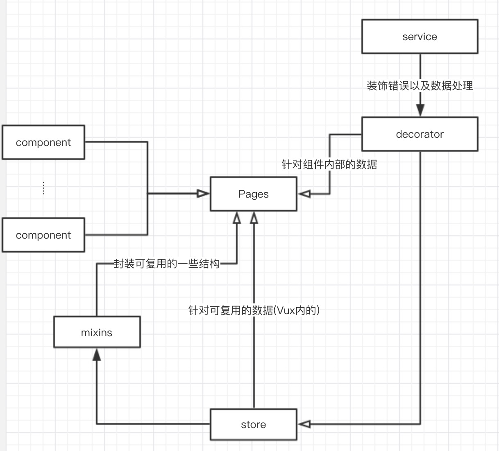

# spa-vue-basic

vue的单页基础后台模板

## 0 适用范围
不需要兼容IE8，不需要SEO的后台项目。尤其适合```搜索-列表```功能较多的系统。

## 1 架构特性

1. 专注于代码结构而非后台通用项目功能，提供最大的自由性
1. 技术架构 ```vue + vuex + vue-router + axios + element-ui + scss + font-awesome```
4. 内置后台常见的```搜索-列表```加速开发，实现了```搜索```与```路由```的对应，可以任意回退到访问过的状态
1. 单页面，前端路由，除首屏外响应速度快（配有简单的loading优化客户体验）
2. 默认配置```Babel```进行代码转义，默认配置```Scss```处理css
3. 使用```.vue```文件进行天然的组件化开发
5. 配有```mock```服务，随着本地服务器一起启动，方便开发

## 2 项目结构
路径 | 内容
:--- | :---
build | 构建及webpack配置文件
config | 本地服务及构建配置文件
src | 项目源码
src/api | api接口 对应后台数据接口
src/assets | 图片等资源文件
src/components | 公共组件
src/decorator | 装饰器
src/mixins | 常用结构的通用抽象
src/pages | 页面及其业务强相关组件
src/router | 前端路由配置
src/services | 服务层 对api划分及异常处理
src/store | Vuex 全局状态层
src/styles | 通用的样式
src/utils | 常用工具函数

## 3 快速开发

### 3.1 全局公共适配方案的修改

1. 在```api```层代码引入了```decorator/ApiDecorator.js```暴露的包装了的get和post方法，需要根据自己的后端接口对代码进行修改，修改方案在代码里有注释说明

1. 在```service```层代码引入了```decorator/ServiceDecorator```暴露的方法来进行服务装饰，主要用于捕获请求的错误并进行统一处理，可以更好的管理，详情见代码注释

1. 在```config/index.js```里修改```proxyTable```换为项目的开发服务器api地址

1. 在```build/mock-server.js```内按demo可添加```mock```服务api接口，在后端未给出接口的时候快速模拟数据开发，数据源可自己写在别的文件夹内不做约定，mock数据多的话可以自行引入```mockjs```来辅助模拟数据

### 3.2 页面与组件的快速开发
面向页面和组件开发，在开发中会经常涉及改动的有 ```api、pages、router、services、store``` 5个目录
1. `api`目录 在api.js中添加函数
    *   在结尾添加与后台提供接口或mock接口对应的api接口函数，写法见api.js中demo
2. `pages`目录 每个模块一个文件夹
    *   模块文件夹内直接编写页面组件
    *   模块文件夹内建立components文件夹编写业务强相关组件
3.  `router`目录 编写index.js中的routes列表来对应前端路由
4.  `services`服务层
    *   对api层进行划分 与模块对应建立```***Services.js```文件，装配对应的api接口和装饰器并导出对应类，具体写法见demo
5.  `store` vuex层 (可根据喜好 也可以不用)
    *   如果有需要全局引用的数据建议在vuex层进行对应修改，在对应的顶层dispatch来调用服务层来设置数据(以此来避免请求的重复发送，该类请求应为幂等请求，并在多个模块都有使用)，具体写法见demo
    *   层划分及模块划分可见Vuex官网 

这些目录下已有文件均为demo，可以根据自己需要更改或编写新的文件，除api和router外其他的都可以在不需要时候删除
## 4 快速命令

### 4.1 快速启动本地开发服务器(带有mock)
```bash
npm start
```
或
```bash
npm run dev
```
### 4.2 构建生成环境代码
```bash
npm run build
```

### 4.3 进行eslint及stylelint检查
```bash
npm run eslint && npm run stylelint
```

## 5 常用构建配置
+   在```config/index.js```进行配置，build下可设置静态资源的公共地址，dev下的proxy可设置代理的目标服务器地址
+   在```build/webpack.base.conf.js```下可配置常用模块的别名及自用的loader，具体可见webpack的文档
+   在```build/webpack.dev.conf.js```下可配置本地开发环境的webpack配置，具体可见webpack的文档
+   在```build/webpack.prod.conf.js```下可配置生产打包的webpack配置，具体可见webpack的文档

## 6 结构示意图


## 7 疑惑解答
1.  在```src/componenets/skeleton```目录下有```App.vue,Header.vue,Main.vue,NavSide.vue```是用来构件后台模板的整体骨架的，可以根据自己设计稿（如果有）的需要修改配置
1.  services层的意义在于对api层进行模块结构的划分，以及引入decorator对请求进行统一的错误处理方式。decorator中的方法用以包装报错的方式，如果需要可自行添加新的错误处理方式。
1. 	decorator中```MessageErrorDecorator```是带有loading处理的装饰器，在页面引入vuex的loading的时候可以自行处理loading的显示与关闭
1.  如果使用Jenkins进行构建的话请将```build/build.js```内所有```chalk```的内容都注释掉，不然会报错部署不成功，具体原因不太清楚 - -|||
1.  mixins里的操作是为了整合大多数重复要写的代码，降低代码的重复率提高可重用性
1.  layouts内整合了常规的项目布局样式，用```slot```方式将要写的具体内容插入，有需要可以自行修改

## 8 tips
> 内置eslint 直接运行 `npm run eslint` 可进行js代码规范检查 如果想在vscode里设置错误提示 需要```Command + ,```用自己的设置覆盖全局设置
```json
"eslint.validate": [
    "javascript",
    "html",
    "vue"
]
```

> stylelint 直接运行 `npm run stylelint` 可进行scss代码规范检查 如果想在vscode里设置错误提示 需要Command + ,用自己的设置覆盖全局设置
```json
"stylelint.additionalDocumentSelectors": [
    "vue"
]
```

> 内置pre-commit 可以在每次提交的时候自动检查代码规范 通过才可以进行commit 若想忽略使用 ```--no-verify```

## 9 flaw
1.  至今没有想到一种能满足1个页面中多个loading的自动处理方案，所以目前的结构只能适应1个页面1个全局Loading处理，其他的还需要自己手动编写一下（在请求之前展示loading，请求之后结束loading）

1.  路由的显示目前仅支持2级结构，不支持太复杂的场景，如果需求很复杂并且显示结构不能与路由表相对应，可能需要想一些别的解决办法，但一般都是足够应付的

1.  编写带有vuex的全局数据时候会略显复杂，不过会带来维护上的可靠性
